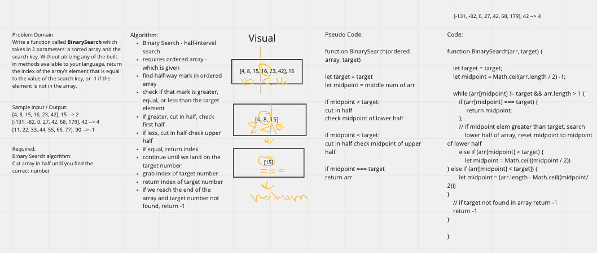

# Insert to Middle of an Array

Write a function called `BinarySearch` which takes in 2 parameters: a sorted array and the search key. Without utilizing any of the built-in methods available to your language, return the index of the array’s element that is equal to the value of the search key, or -1 if the element is not in the array.

## Whiteboard Process

## Approach & Efficiency

I decided to begin by laying out sample data and reiterating the problem domain requirements to clarify my understanding of the problem. In this case found it easier to write out the algorithm steps before drawing the visual. After the visual, I had a clearer understanding of what kind of approach was necessary to generate the correct output and based my pseudo code and actual code on those steps.