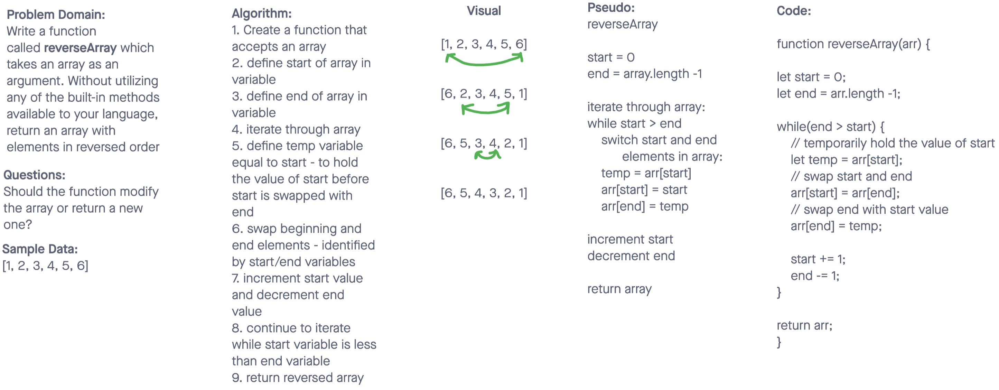

# Reverse an Array

Write a function called reverseArray which takes an array as an argument. Without utilizing any of the built-in methods available to your language, return an array with elements in reversed order.

## Whiteboard Process

## Approach & Efficiency
I decided to go organize my whiteboard in to the following sections: Problem Domain, Questions, Sample Data as provided in the instructions, Algorithm, Visual, Pseudo Code, and Code. I chose this approach becuase it allowed me to define the problem, think of any questions I would want to ask and utilize sample data. Additionally I found it easier to write out the problem in words and then draw it so I decided to define my Algorithm steps prior to the Visual. After that, I translated the Algorithm steps into pseudo code while and then translated the pseudo code steps into actual code.