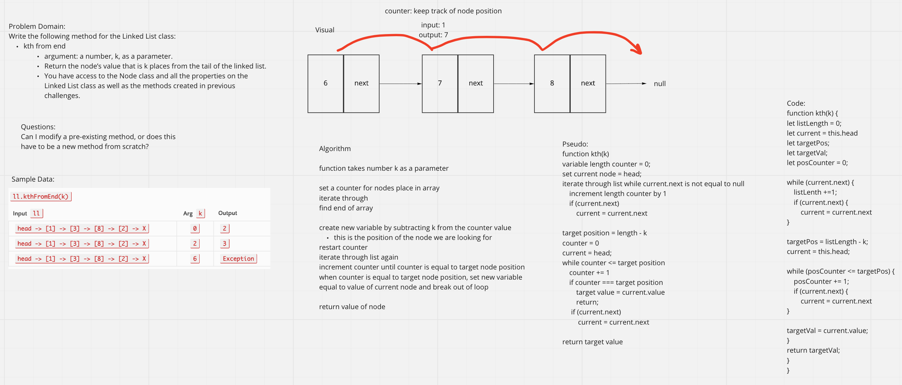

# Challenge Summary

- Write the following method for the Linked List class:

- kth from end
  - argument: a number, k, as a parameter.
  - Return the node’s value that is k places from the tail of the linked list.
  - You have access to the Node class and all the properties on the Linked List class as well as the methods created in previous challenges.

## Whiteboard Process

## Approach & Efficiency

I used a while loop to find the lenght of the list, subtracted the value of k from the length of the list to find the position of the node, then iterated through the list until landing on the correct node and returning its value.

Big O: O(n)

## Solution

- linkedlist.kth(k)
  - takes an integer as a param - k places from the end of the list
  - finds the position of that node in the list
  - returns the nodes value at that place in the list
