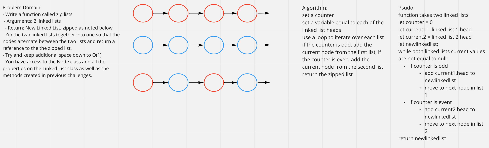

# Challenge Summary

- Write a function called zip lists
  - Arguments: 2 linked lists
  - Return: New Linked List, zipped as noted below
- Zip the two linked lists together into one so that the nodes alternate between the two lists and return a reference to the the zipped list.
- Try and keep additional space down to O(1)
- You have access to the Node class and all the properties on the Linked List class as well as the methods created in previous challenges.

## Whiteboard Process

## Approach & Efficiency

I set a counter and used a while loop to iterate through the two linked lists. If the counter value was even, I added the current node from the first linked list to the new, zipped linked list. If the counter value was odd, the current node from the second linked list is added to the zipped linked list.

Big O: O(n)

## Solution

How to run the function:

- zipLinkedLists(list1, list2)
