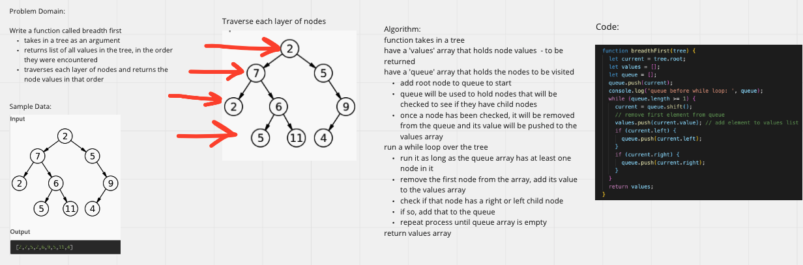

# Challenge Summary

- Write a function called breadth first
  - Arguments: tree
  - Return: list of all values in the tree, in the order they were encountered

## Whiteboard Process

## Approach & Efficiency
<!-- What approach did you take? Why? What is the Big O space/time for this approach? -->

- the function takes a binary tree as a parameter
- initiate a 'values' array to hold the tree values
- initiate a 'queue' array to keep track of the tree nodes (the entire node is pushed to the queue)
- push the root node to the 'queue' array to start
- ran a while loop and checked each node for a left and right
  - the loop runs as long as their is at least one node left in the queue
- if a left or right node exists, push that node to the queue
- at the beginning of the loop, remove the first node in the queue and add its value to the 'values' array
- this way we can traverse each level of nodes, while keeping track of nodes visited in the queue, and once a node has been visited, it can be removed from the queue and its value stored in the 'values' array
- the 'values' array is returned when the loop is finished iterating through the tree

Big O: O(n)

## Solution
<!-- Show how to run your code, and examples of it in action -->
- breadthFirst(tree)
  - the tree parameter is a binary tree
  - returns an array of breadth first values

## Resources

- JavaScript Algorithms and Data Structures Masterclass by Colt Steele - Udemy
