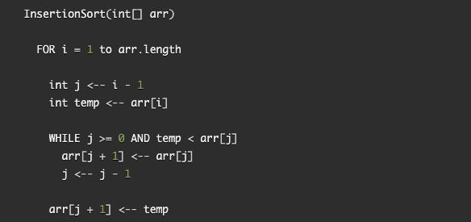
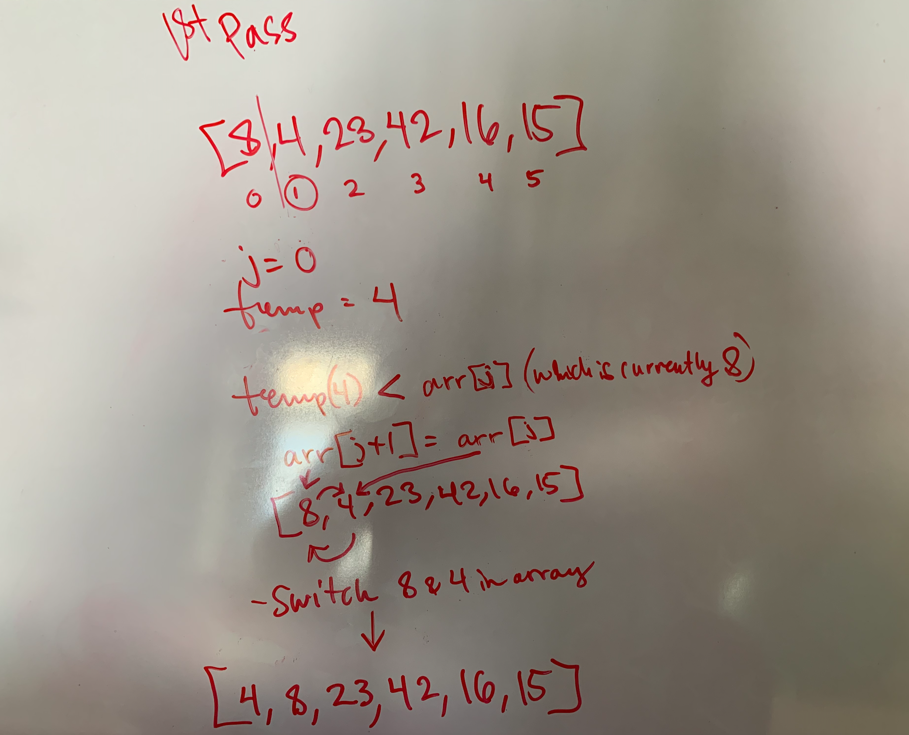
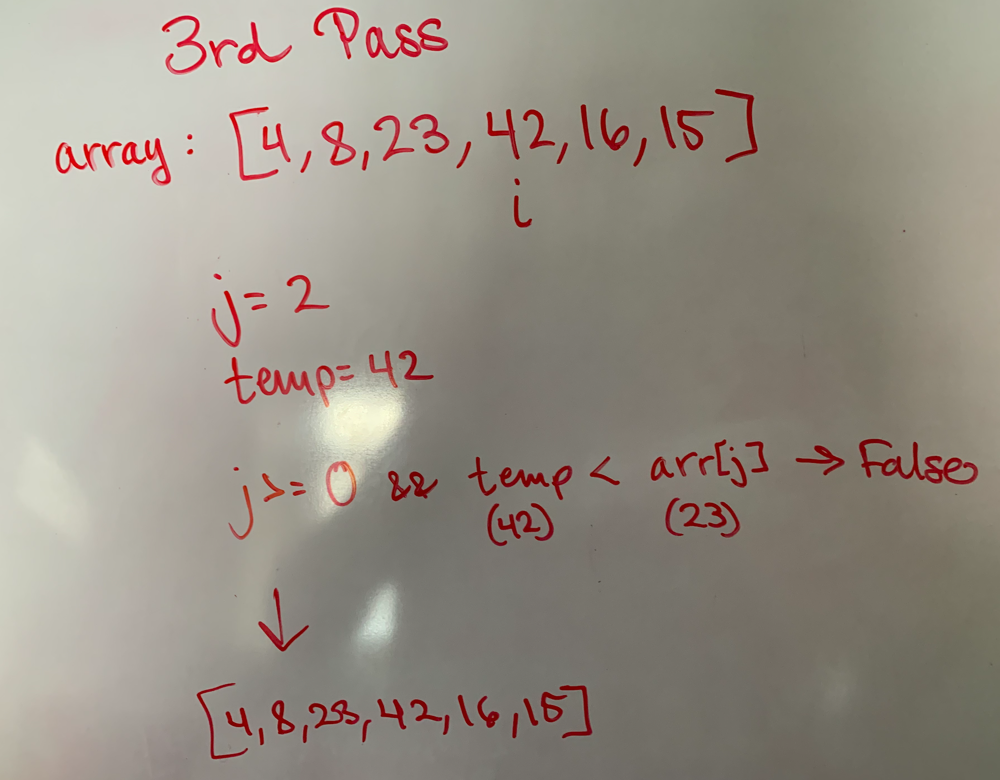
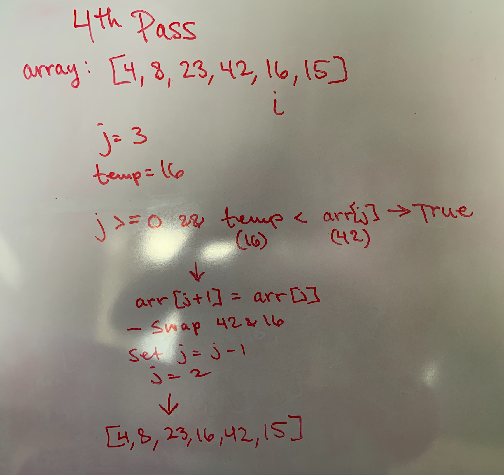
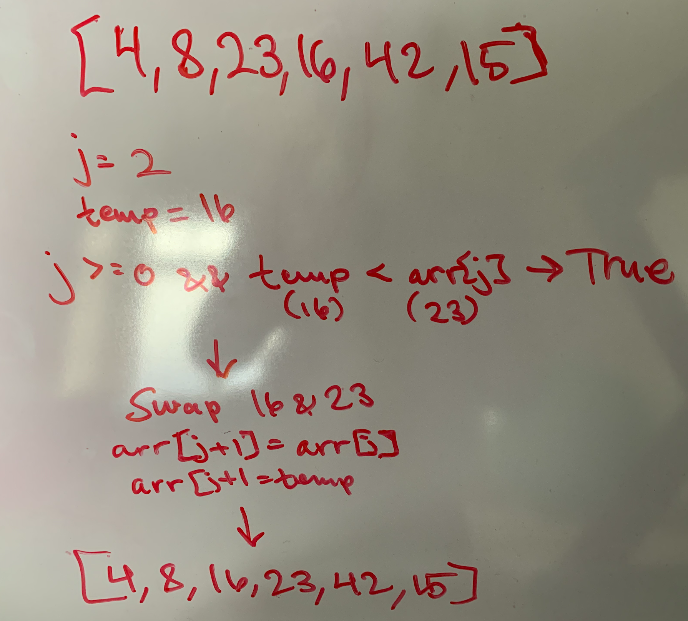
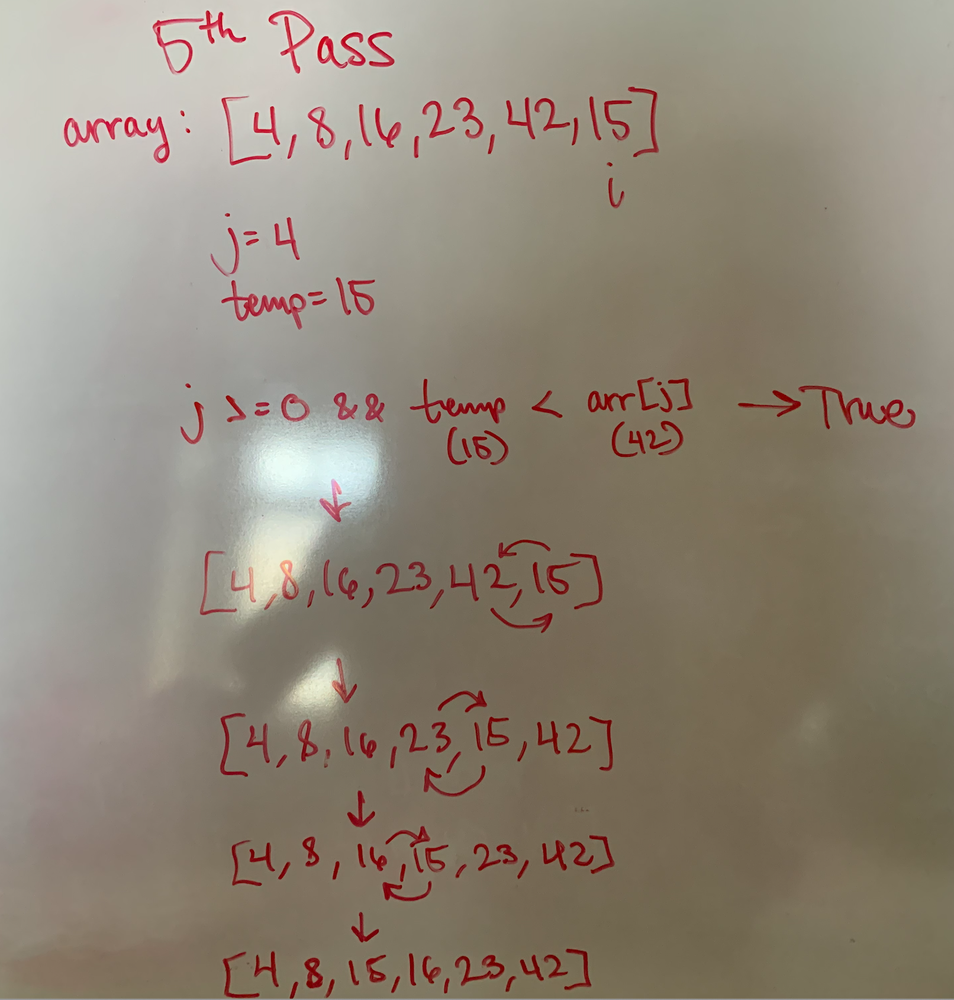

# Insertion Sort

## Pseudo Code



### Sample Code

``` JS
[8,4,23,42,16,15]
```

### Pass 1



For the first iteration of the for loop, j is set to index 0. Temp is set to 4. Since temp (currently equal to 4) is less than arr[i] (currently equal to 8), we swap 8 and 4. The array is now equal to `[4, 8, 23, 42, 16, 15]`.

### Pass 2


On the second iteration of the for loop, j is equal to index 1. Temp is equal to 23. Because temp is not less than arr[j], the while loop does not run, and the array remains unchanged for this iteration.

### Pass 3



For the 3rd iteration, temp is equal to 42. j references the index 2, which currently holds the value 23. The code in the while loop evaluates to false since temp is greater than the value of arr[j]. The array remains unchanged for this iteration of the for loop.

### Pass 4



while loop 2nd execution:


In this iteration, the while loop runs twice. j now references position 3. Temp is equal to 16. The while loop evaluates to true and the values 42 and 16 are swapped in the array. j is then decremented to reference position 2 in the array. Because the value of temp (16) is still less than arr[j] (23), the while loop executes a second time. This time 23 and 16 are swapped. The resulting array is [4, 8, 16, 23, 42, 15].

### Pass 5



The temp is now equal to 15. j references position 4 in the array. Because the temp is less than arr[j], the while loop executes and 42 is swapped with 15. The while loop continues to run until 15 is shifted to position 2 in the array. The array is now fully sorted.
