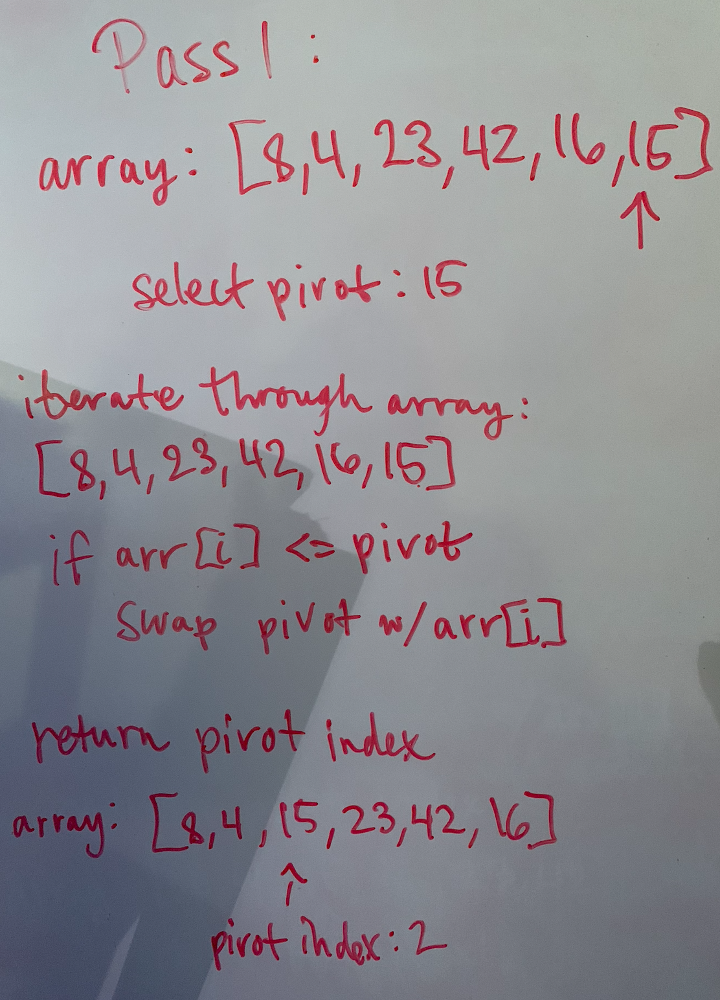
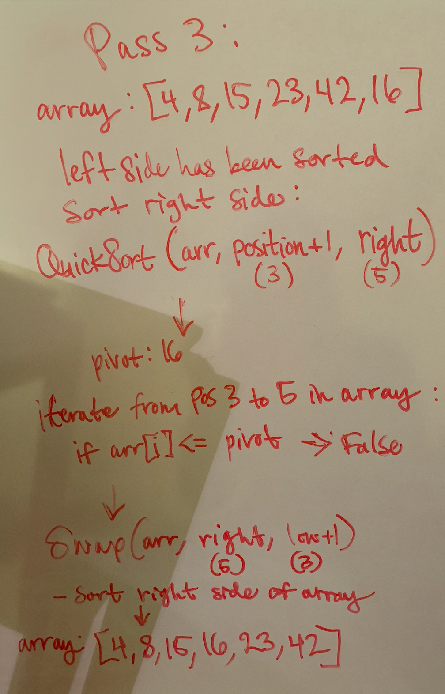

# Quick Sort

## Pseudo Code

```JS
ALGORITHM QuickSort(arr, left, right)
    if left < right
        // Partition the array by setting the position of the pivot value
        DEFINE position <-- Partition(arr, left, right)
        // Sort the left
        QuickSort(arr, left, position - 1)
        // Sort the right
        QuickSort(arr, position + 1, right)

ALGORITHM Partition(arr, left, right)
    // set a pivot value as a point of reference
    DEFINE pivot <-- arr[right]
    // create a variable to track the largest index of numbers lower than the defined pivot
    DEFINE low <-- left - 1
    for i <- left to right do
        if arr[i] <= pivot
            low++
            Swap(arr, i, low)

     // place the value of the pivot location in the middle.
     // all numbers smaller than the pivot are on the left, larger on the right.
     Swap(arr, right, low + 1)
    // return the pivot index point
     return low + 1

ALGORITHM Swap(arr, i, low)
    DEFINE temp;
    temp <-- arr[i]
    arr[i] <-- arr[low]
    arr[low] <-- temp
```

## Sample Data

```JS
[8,4,23,42,16,15]
```

## Pass 1 - first Quicksort call



Quicksort is initially called with the original array. Assuming the left value is 0 and the right value is arr.length (5), the boolean left < right will evaluate to true and Partition() will be called. The pivot will be set to the value of right which is 15. The array will be iterated through and if the current index is less than or equal to 15, the values will be swapped. Partition will then return the new index of 15, which is now 2. All of the values to the left of 15 are less than it, and all of the values to the right are greater.

## Pass 2 - 2nd Quicksort call


Now that a partition position has been established, Quicksort is now called with the modified array to sort the left side of the partition. Left is equal to 0, and right is equal to 1, the index directly to the left of the partition. In this case there are only two numbers to the left of the partition, 4 and 8 which will be swapped, sorting the left side of the partition. The array now reads: [4, 8, 15, 23, 42, 16].

## Pass 3 - 3rd Quicksort call



Now that the left side of the array is sorted, the right side will be sorted. The modified array is passed back into Quicksort along with the left and right most indicies of the right side of the partition (left = 3, right = 5). The cycle will continue recursively until the right side of the array is fully sorted and the final array reads [4, 8, 15, 16, 23, 42].
