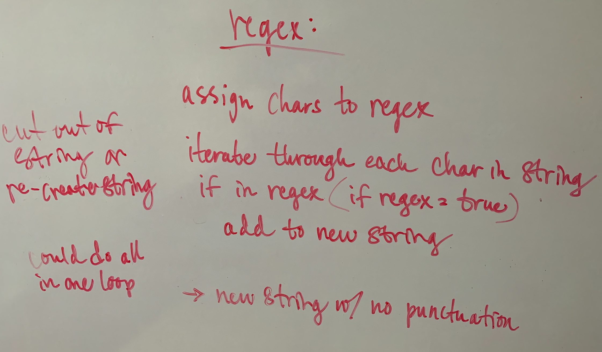

# Hashmap Repeated Word

## Challenge Summary

- Write a function called repeated word that finds the first word to occur more than once in a string
  - Arguments: string
  - Return: string

## Whiteboard Process

## Approach & Efficiency

- Function converts string to lowercase
- uses regex to re-create the string without punctuation
- creates array of words by spliting new string
- set an empty tracker array
- loops through array of words
  - checks to see if word is already in tracker array
  - if word is found, returns word
  - if word is not found, adds word to tracker array
- if no duplicate words are found, returns a message stating so

Big O: O(n^2)
