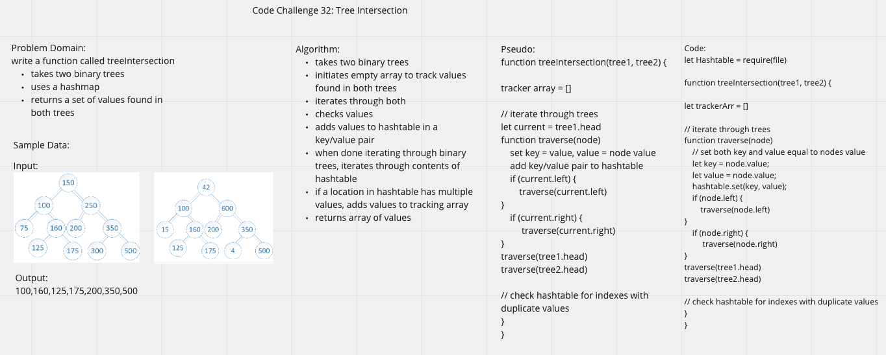

# Tree Intersection

# Challenge Summary

- Write a function called `tree_intersection` that takes two binary trees as parameters.
- Using your Hashmap implementation as a part of your algorithm, return a set of values found in both trees.

## Whiteboard Process

## Approach & Efficiency

- the treeIntersection function takes in two trees and a hashtable
- it traverses both trees and adds them to the hash table
  - the key and value are both equal to the value of the node
  - at the beginning of each traversal, the set method  is called, which returns a value whenever a value is added to a preexisting bucket - this is how repeat values are identified
  - repeat values are pushed to an array
- when both trees have been traversed, the array of repeat values is returned

Big O: O(n)

## Resources

- Andrew Enyeart
