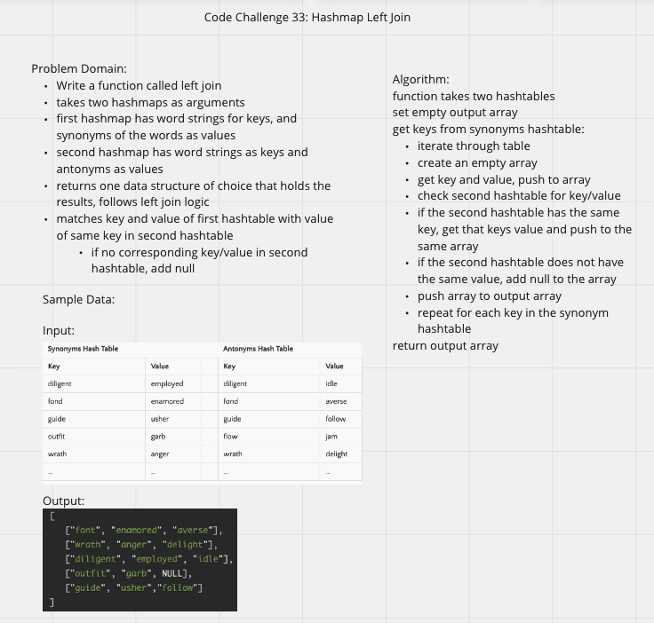

# Hashmap Left Join

## Challenge Summary

- Write a function called `left join`
- Arguments: two hash maps
  - The first parameter is a hashmap that has word strings as keys, and a synonym of the key as values.
  - The second parameter is a hashmap that has word strings as keys, and antonyms of the key as values.
- Return: The returned data structure that holds the results is up to you. It doesn’t need to exactly match the output below, so long as it achieves the LEFT JOIN logic

## Whiteboard Process

## Approach & Efficiency

- sets output array
- gets keys from synonym hashmap
- iterates through keys
  - gets values associated with keys
  - pushes key and value to array
  - checks if key is in antonym hashmap
  - if present, adds associated value to the array
  - if not present, adds null to the array
  - pushes array to output array
- returns output array containing the keys and values from the synonym array and the values of the same keys (or null if not found) in the antonym array

Big O: O(n^2)
