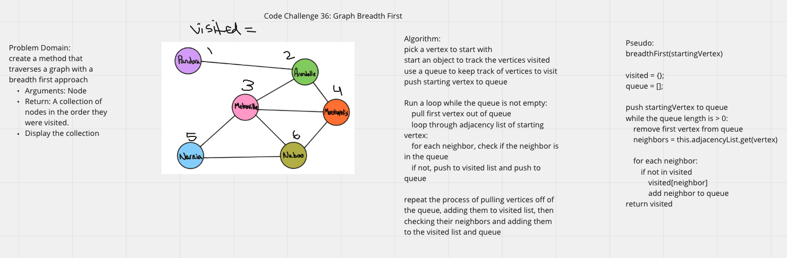

# Graph Breadth First

## Challenge Summary

- Write a breadth first traversal method for the Graph class
  - Arguments: Node
  - Return: A collection of nodes in the order they were visited.
  - Display the collection

## Whiteboard

## Approach & Efficiency

## Resources
