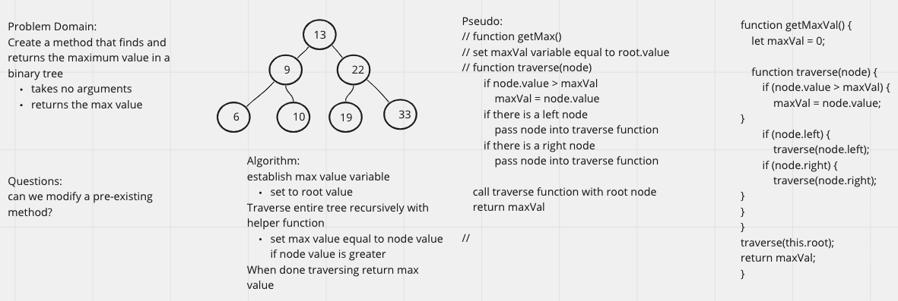

# Challenge Summary

Write the following method for the Binary Tree class:

- find maximum value
  - Arguments: none
  - Returns: number
- Find the maximum value stored in the tree. You can assume that the values stored in the Binary Tree will be numeric.

## Whiteboard Process

## Approach & Efficiency
<!-- What approach did you take? Why? What is the Big O space/time for this approach? -->

I used recursion to traverse the tree and a variable called maxVal to hold the highest value. The function checks to see if each nodes value is larger than the current value of maxVal, if it is, it sets maxVal equal to the value of the node.

## Solution
<!-- Show how to run your code, and examples of it in action -->
tree.getMax() - tree is a populated binary tree
